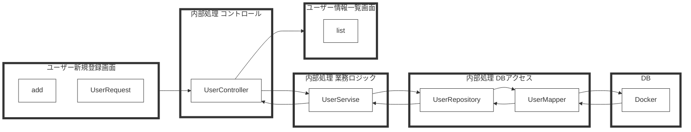

# TechPit_Javaスクール_総合問題
1, 概要  
本アプリケーションはユーザー情報の一覧と新規登録ができるシステムです。  
  
・ユーザー情報一覧画面では、登録した情報を確認できます。  
http://localhost:8080/user/list  
  

・「新規登録はこちら」をクリックすると、ユーザーの新規登録ができます。  
http://localhost:8080/user/add
  

主要機能  
ユーザー情報一覧画面：すべてのユーザー情報を一覧表示します。  
ユーザー新規登録画面：ユーザー名、パスワード、メールアドレスを入力して登録します。パスワードは暗号化されて保存されます。  
  
2, 使用技術  
- java ver21
- springframework.boot version 3.2.1
- Gradle
- Spring Web
- Thymeleaf
- Lomback
- PostgreSQL Driver	
- MySQL
- Mybatis
- Docker/Docker-compose
- A5:SQL Mk-2  SQL Client/ER Diagram tool
- VScode
  
3, 構成図  
ユーザー新規登録の流れ

  
Javaの中級研修で学んだことを、実務で使用するような開発環境で実際に実装～動作確認を行いました。
